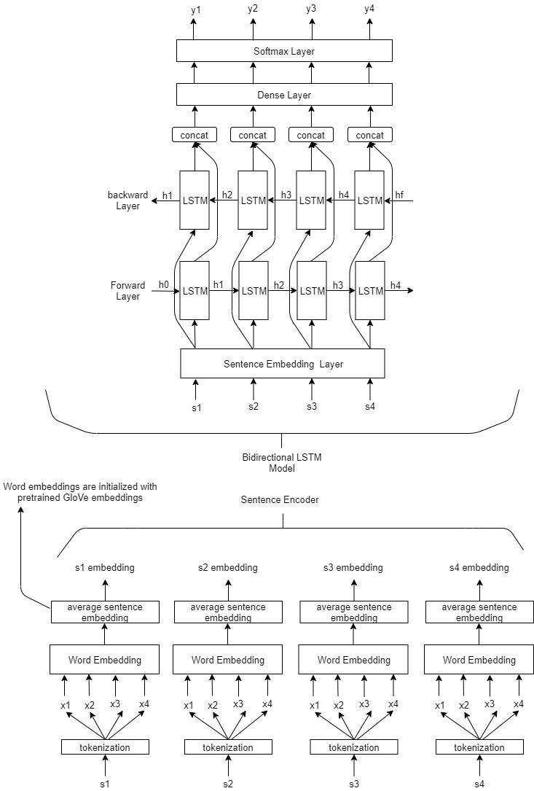

## News article summarization

Summarization of content is an important research area for Natural Language Processing. Summarizing news articles is an important branch of this research. News publications like Associated Press, Bloomberg and Reuters are actively working on automating stories in different beats such as finance and sports.  

Readers often don't have time to read through entire articles, and reading only the headline and sub-heading does not inform them of all the important points discussed in the article. Also, it is not possible for news publications to prepare summaries of every article they publish. So, it may be a good idea for news apps to have in-built features that can summarize articles for them.

In this project, we attempt to generate summaries of news articles by extracting important sentences from a news article. Our work was inspired by a research paper on Content selection in Deep Learning Models of summarization by Prof. Kathleen McKeown and Chris Kedzie:
https://arxiv.org/pdf/1810.12343v2.pdf

Code from their research is available on the following repositories: 
*   https://github.com/kedz/nnsum 
*   https://github.com/kedz/summarization-datasets

While the research paper uses corpora from different fields, such as news, personal stories, meetings and medical reports, we are only concentrating on extractive summaries of news articles. We have used the CNN/Daily Mail corpus for this project.

The previous repo is for model training and evaluation, and the latter one is for preprocessing the different datasets used in the paper.

Our analysis is of a smaller scale, so we went for a bidirectional LSTM model for this project. We used 23,000 articles to train the sentence embeddings and the model, 5,000 articles for validation and 5,000 articles for test. The Rough-1 score for our project is 0.351.

We have used three notebooks for this project, two for preprocessing the data and one for training and evaluating the model.

The following image shows the architecture of the project.

